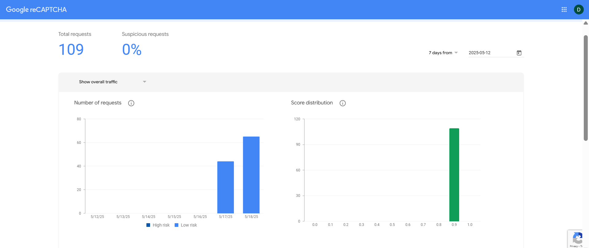
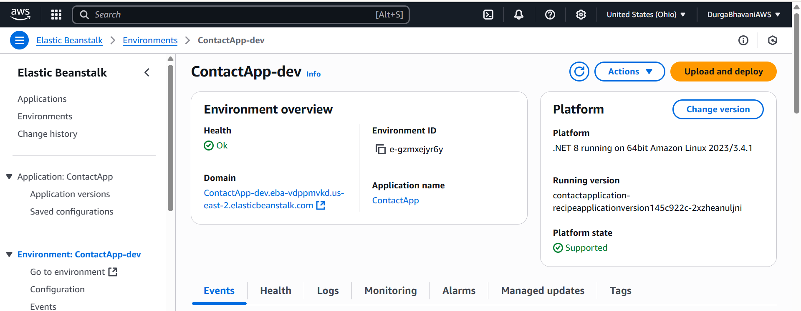

# Contact Form Web Application

This is a  ASP.NET Core MVC web application featuring client/server-side validation, Google reCAPTCHA v3 integration, AWS deployment with RDS and Elastic Beanstalk, secure secrets handling via AWS Secrets Manager, and rate-limiting protection.

---

## Architecture Overview

### MVC Design Pattern
- **Model**: `ContactViewModel.cs` defines the form structure and validation rules.
- **View**: `Contact.cshtml` renders the form and integrates client-side validation and reCAPTCHA.
- **Controller**: `ContactController.cs` handles GET/POST requests, performs model validation, and handles logic.


## Validation Strategy

The application enforces validation at two levels to ensure data integrity and security: **client-side** and **server-side**.

### Client-Side Validation

Client-side validation is implemented using **data annotations** in the `ContactViewModel.cs` file. Attributes like `[Required]`, `[EmailAddress]`, and `[StringLength]` are applied to input fields.
- **Example**:  
  If a user tries to submit the form without entering required fields, validation messages like **“First Name is required”** or **“Email is required”** will be displayed immediately, without a page reload.

This provides a smooth user experience by preventing submission of invalid forms on the client side.

### Server-Side Validation

Server-side validation is essential for security, ensuring no invalid data is processed even if client-side checks are bypassed.

- Implemented by checking `ModelState.IsValid` in the `ContactController`'s POST action.
- Also includes **Google reCAPTCHA v3 score validation**.
- **Example**:  
  After form submission, the reCAPTCHA token is sent to Google’s API. If the returned score is less than `0.5`, the request is rejected.  
  In testing, if we **force the threshold to `0.99`**, valid users may receive an error message like:  
  **“reCAPTCHA validation failed”**
  


This dual-layered validation approach ensures both user-friendliness and protection against automated bots or malicious inputs.


## Google reCAPTCHA v3 Integration

### Implementation

- On page load, the frontend generates a reCAPTCHA token using the configured site key.
- The token is included as a hidden input in the form and submitted with the user's input.
- On the server, the `ContactController` sends the token and secret key to the Google API for validation.
- The returned score is evaluated:
- If the score is **greater than or equal to 0.5**, the request is considered valid.
- If the score is **below 0.5**, the request is rejected with a user-friendly error message.
- Both the **site key** and **secret key** are securely stored in **AWS Secrets Manager** and retrieved at runtime using the `AwsSecretsHelper` class.

### Benefits

- Fully transparent to users with no interruption or additional input required.
- Significantly reduces bot submissions and spam without degrading the user experience.
- Enables flexible handling of suspicious requests based on scoring thresholds.

- **Verification Result Logging**: via log4net
### Google reCAPTCHA Dashboard

The screenshot below illustrates real activity captured on the Google reCAPTCHA v3 dashboard after integrating it into the contact form.



#### Key Metrics

- **Total Requests:** 109
- **Suspicious Requests:** 0% - No potentially harmful or bot-driven interactions detected.
- **Request Volume Chart:** Displays daily traffic from May 12 to May 18, 2025, peaking around 80 requests per day.
- **Score Distribution:**
  - Majority of requests scored between **0.8 and 1.0**, indicating legitimate human activity.
  - No significant volume in low-score ranges (below 0.5), confirming the effectiveness of frontend validation.
- **Top Actions / Suspicious Traffic:** No specific suspicious actions were recorded, further validating the robustness of form design.

These metrics confirm that reCAPTCHA is functioning effectively in background mode, filtering requests based on user behavior without impacting the user experience.


## Rate Limiting

Rate limiting is implemented to prevent abuse of the contact form by limiting how many times a user can submit data within a short time frame.

### Implementation

This application uses the built-in **ASP.NET Core Rate Limiting API** (available in .NET 8) via the `System.Threading.RateLimiting` namespace.

- A custom policy named `"ContactFormPolicy"` is defined in `Program.cs`.
- This policy restricts the number of POST requests allowed per IP within a fixed window of time.
- The rate limiter is registered with `builder.Services.AddRateLimiter(...)`.
- The `ContactController` POST action is decorated with `[EnableRateLimiting("ContactFormPolicy")]` to enforce the rule.

### Example Use

If a user exceeds the allowed number of requests (e.g., 5 per minute), they will receive a `429 Too Many Requests` HTTP response.

### Benefits

- Helps prevent bots or users from spamming the form.
- Protects backend resources and ensures fair usage.
- Works in tandem with reCAPTCHA v3 to provide layered defense.

## NuGet Packages Used

| Package                              | Purpose                         |
|--------------------------------------|---------------------------------|
| `Microsoft.AspNetCore.Mvc`           | MVC framework                   |
| `Google.reCAPTCHA`                   | reCAPTCHA validation            |
| `AspNetCoreRateLimit`                | Request throttling              |
| `Amazon.SecretsManager`              | AWS Secrets retrieval           |
| `log4net`                            | Logging system                  |


## Database Design (SQL Server on AWS RDS)

### Schema

Created using SSMS after connecting to the AWS RDS SQL Server instance:

```sql
CREATE TABLE [dbo].[Contact] (
    [Id] INT IDENTITY(1,1) PRIMARY KEY,
    [FirstName] NVARCHAR(50) NOT NULL,
    [LastName] NVARCHAR(50) NULL,
    [Email] NVARCHAR(50) NOT NULL,
    [Phone] NVARCHAR(50) NULL,
    [Zip] NVARCHAR(20) NULL,
    [City] NVARCHAR(30) NULL,
    [State] NVARCHAR(30) NULL,
    [Comments] NVARCHAR(100) NULL,
    [CreatedAt] DATETIME2 NOT NULL DEFAULT GETDATE()
);
```

### How It Was Set Up

- Provisioned an RDS instance (SQL Server) using AWS Console.
- Connected via SQL Server Management Studio (SSMS) using RDS endpoint.
- Executed CREATE TABLE command for contact data.
- Inbound access on port 1433 configured via security group.

## AWS Configuration

### Secrets Manager
- Used for: reCAPTCHA site keys, database credentials.
- Retrieved securely using AWS SDK in `AwsSecretsHelper.cs`.
- Avoided hardcoded values for production deployment.

### IAM Roles
- IAM role attached to Elastic Beanstalk environment provided access to Secrets Manager.
- No access key ID or secret key used directly in code.

### AWS Toolkit (Visual Studio)
- Used only for publishing the application to Elastic Beanstalk.
- Environment variables configured via AWS Elastic Beanstalk console or deployment settings.

## Unit Testing

- Tests for `ContactController` validate:
  - Form submission
  - reCAPTCHA result handling
  - Server-side validation logic

## Deployment

- Application deployed via AWS Elastic Beanstalk using Visual Studio's AWS Toolkit.
- .NET Core environment selected with proper appsettings and environment variables.

**Live Deployment**:  
http://contactapp-dev.eba-vdppmvkd.us-east-2.elasticbeanstalk.com/

### Elastic Beanstalk Deployment

Shows the deployed environment in AWS Elastic Beanstalk including health status and app URL.



---

### SSMS Connected to AWS RDS

Displays the SQL Server Management Studio (SSMS) connected to the RDS instance and the `Contact` table.


---

### AWS RDS Instance Configuration

Details the configuration of the RDS SQL Server instance, such as engine type, endpoint, port, and access settings.


## Challenges Faced

- IAM Permissions: Faced deployment issues initially due to IAM role not having access to Secrets Manager.
- reCAPTCHA Issues: Key mismatches caused loading problems until the correct environment variables were set.
- Environment-Specific Settings: Setup required careful alignment between local appsettings and AWS configuration.


## Assumptions

- Application is hosted in a single AWS region.
- SSMS is available for DB admin tasks.
- The application is hosted in AWS using Elastic Beanstalk with single instance. It can be adjusted to use load balancer looking at the traffic it’s receiving.


## Architectural Decisions

- ASP.NET Core MVC used for structure and testability.
- AWS RDS used for managed DB hosting.
- Secrets Manager and IAM roles chosen for security.


## Improvements Recommended

- The server logs written using log4net can be fed to AWS cloud watch
- Cloudformation templates for the AwS resources used.
- Load secret manager details to cache once the program is loading .. once the program loads query the cache instead of calling secrets manager each time 
